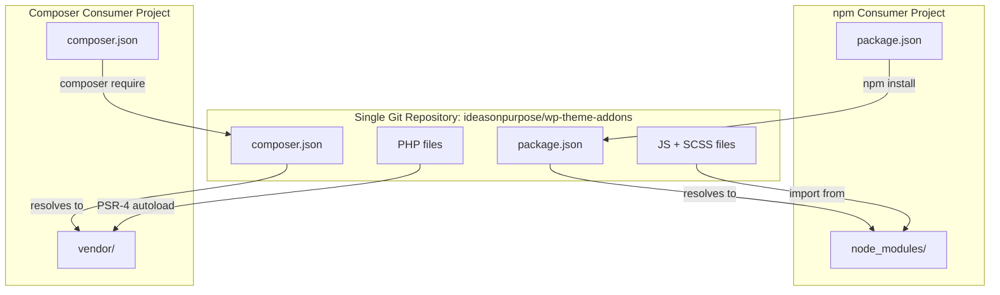

# WordPress Theme Addons

#### Version 0.1.1

This repository contains JavaScript add-ons for the WordPress Block Editor. The project is currently private and under continual development.

## What's in here

### Linked Group Block

A variation on the Group block which adds standard Link controls. The link implementation uses ideas from [Accessible cards](https://kittygiraudel.com/2022/04/02/accessible-cards/) and [Inclusive Components: Cards](https://inclusive-components.design/cards/).

### Related Posts Query

A variation on the Query Loop block which replaces the query with content from IOP's [WordPress Related Posts](https://github.com/ideasonpurpose/wp-related-posts) library.

### Utilities

A few utility classes are exported. `usePublicPostTypes` and `usePublicTaxonomies` are direct lifts from the [WordPress Gutenberg source code](https://github.com/WordPress/gutenberg/blob/e90c88fee31120e0091e044c149f8b4f5f947f4a/packages/edit-site/src/components/add-new-template/utils.js#L91-L125). These functions are useful for pre-populating a WordPress data-store with all PostType and Taxonomy data for use in interfaces or block rendering.

## Installation

### Prerequisites

- SSH access to GitHub configured (your SSH key must be added to your GitHub account)
- You or the consuming project must have access to this private repository

### npm

```sh
npm install git+ssh://git@github.com:ideasonpurpose/wp-theme-addons.git
```

Or in `package.json`:

```json
{
  "dependencies": {
    "@ideasonpurpose/wp-theme-addons": "git+ssh://git@github.com:ideasonpurpose/wp-theme-addons.git"
  }
}
```

Then run:

```bash
npm install
```

### Composer

Add the VCS repository and require the package in your project's `composer.json`:

```json
{
    "repositories": [
        {
            "type": "vcs",
            "url": "git@github.com:ideasonpurpose/wp-theme-addons.git"
        }
    ],
    "require": {
        "ideasonpurpose/wp-theme-addons": "dev-main"
    }
}
```

Then run:

```sh
composer install
```

## Usage

### JavaScript

Import one of the included packages into **editor.js** or whatever script loads in your editor:

```javascript
// @link https://github.com/ideasonpurpose/wp-theme-addons
import { initLinkedGroupBlock } from "@ideasonpurpose/wp-theme-addons";

// Instantiate the function
initLinkedGroupBlock();
```

Also add the matching Sass frontend styles:

```scss
// Import linked-group-front-end styles
// @link https://github.com/ideasonpurpose/wp-theme-addons
@use "@ideasonpurpose/wp-theme-addons/editor/block/variation/group-linked-group/linked-group-front-end";
```

### PHP

```php
use IdeasOnPurpose\WP\Theme\Addons\Block\Variation\Group\LinkedGroup\LinkedGroup;
use IdeasOnPurpose\WP\Theme\Addons\Block\Variation\Query\RelatedPostsQuery\RelatedPostsQuery;

new LinkedGroup();
new RelatedPostsQuery();
```


## Coexistence

npm and Composer operate independently in the same repository:

| | npm | Composer |
|---|---|---|
| **Config** | `package.json` | `composer.json` |
| **Package name** | `@ideasonpurpose/wp-theme-addons` | `ideasonpurpose/wp-theme-addons` |
| **Installs to** | `node_modules/` | `vendor/` |
| **Serves** | JS + SCSS | PHP |
| **Imports resolve via** | npm package name | PSR-4 autoloading |

No conflicts: separate config files, separate dependency directories, separate language ecosystems.



- **npm** reads `package.json` → installs to `node_modules/` → JS/SCSS imports resolve via `@ideasonpurpose/wp-theme-addons`
- **Composer** reads `composer.json` → installs to `vendor/` → PHP classes autoload via PSR-4
- No conflicts: separate config files, separate dependency directories, separate language ecosystems.
