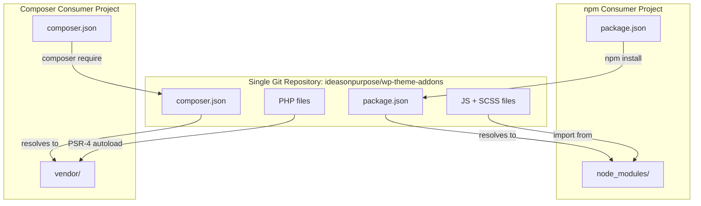

# WordPress Theme Addons

#### Version 0.3.0

[](https://www.npmjs.com/package/@ideasonpurpose/wp-theme-addons)
[](https://packagist.org/packages/ideasonpurpose/wp-theme-addons)


This repository contains JavaScript and PHP add-ons for the WordPress Block Editor and Hybrid themes. The project is used in production, but is under active development and implementations are likely to change. 

## What's in here

### Block Variations

#### Linked Group Block

A variation on the Group block which adds standard Link controls. The link implementation uses ideas from [Accessible cards](https://kittygiraudel.com/2022/04/02/accessible-cards/) and [Inclusive Components: Cards](https://inclusive-components.design/cards/).

#### Related Posts Query

A variation on the Query Loop block which replaces the query with ranked related posts. Ranking lives in `lib/RelatedPosts` (`IdeasOnPurpose\WP\RelatedPosts`) — weighted shared taxonomies, post type, and recency, with optional REST at `GET /wp-json/ideasonpurpose/v1/related_posts/{id}`.

### CSS Local Props

Injects block color attributes as CSS custom properties (`--local-text-color`, `--local-bg-color`, `--local-border-color`) so theme styles can use them.

This feature include a pair of front-end and block editor files:

| File                               | Runtime                           | Role                                                                                                                                                                |
| ---------------------------------- | --------------------------------- | ------------------------------------------------------------------------------------------------------------------------------------------------------------------- |
| `CssLocalProps/CssLocalProps.php`  | PHP (frontend + editor bootstrap) | On `render_block`, writes the local props onto the outer wrapper tag. On `enqueue_block_editor_assets`, localizes the allowed-block list to `window.iopLocalProps`. |
| `CssLocalProps/css-local-props.js` | Block editor                      | Higher-order component on `editor.BlockListBlock` that injects the same vars into `wrapperProps.style` for live editor preview.                                     |

Named colors from theme.json are converted to `var(--wp--preset--color--*)`; custom hex/rgb values pass through as-is.

By default only `core/button` is targeted. Change the list from PHP:

```php
add_filter('iop/add_css_local_props_allowed_blocks', fn() => ['core/button', 'core/group']);
```

Both sides must stay in sync: enable PHP for frontend output and call `initCssLocalProps()` in the editor bundle so the canvas matches the saved markup.

### Utilities

A few utility classes are exported. `usePublicPostTypes` and `usePublicTaxonomies` are direct lifts from the [WordPress Gutenberg source code](https://github.com/WordPress/gutenberg/blob/e90c88fee31120e0091e044c149f8b4f5f947f4a/packages/edit-site/src/components/add-new-template/utils.js#L91-L125). These functions are useful for pre-populating a WordPress data-store with all PostType and Taxonomy data for use in interfaces or block rendering.

## Installation

### Prerequisites

- SSH access to GitHub configured (your SSH key must be added to your GitHub account)
- You or the consuming project must have access to this private repository

### npm

```sh
npm install @ideasonpurpose/wp-theme-addons
```

Or in `package.json`:

```json
{
  "dependencies": {
    "@ideasonpurpose/wp-theme-addons": "^0.2.2"
  }
}
```

### Composer

Add the VCS repository and require the package in your project's `composer.json`:

```json
{
    "repositories": [
        {
            "type": "vcs",
            "url": "git@github.com:ideasonpurpose/wp-theme-addons.git"
        }
    ],
    "require": {
        "ideasonpurpose/wp-theme-addons": "dev-main"
    }
}
```

## Usage

### JavaScript

Import one of the included packages into **editor.js** or whatever script loads in your editor:

```javascript
// @link https://github.com/ideasonpurpose/wp-theme-addons
import { initLinkedGroupBlock, initCssLocalProps } from "@ideasonpurpose/wp-theme-addons";

// Instantiate the function
initLinkedGroupBlock();
initCssLocalProps();
```

Also add the matching Sass frontend styles:

```scss
// Import linked-group-front-end styles
// @link https://github.com/ideasonpurpose/wp-theme-addons
@use "@ideasonpurpose/wp-theme-addons/editor/block/variation/group-linked-group/linked-group-front-end";
```

### PHP

```php
use IdeasOnPurpose\WP\RelatedPosts;
use IdeasOnPurpose\WP\Theme\Addons\Block\Variation\Group\LinkedGroup\LinkedGroup;
use IdeasOnPurpose\WP\Theme\Addons\Block\Variation\Query\RelatedPostsQuery\RelatedPostsQuery;
use IdeasOnPurpose\WP\Theme\Addons\CssLocalProps\CssLocalProps;

new LinkedGroup();
new RelatedPostsQuery(); // also loads RelatedPosts for ranking + REST
new CssLocalProps();

// Optional: use the ranker directly
// $posts = (new RelatedPosts())->get(['post' => $id, 'posts_per_page' => 4]);
```

## Coexistence

npm and Composer operate independently in the same repository:

|                         | npm                               | Composer                         |
| ----------------------- | --------------------------------- | -------------------------------- |
| **Config**              | `package.json`                    | `composer.json`                  |
| **Package name**        | `@ideasonpurpose/wp-theme-addons` | `ideasonpurpose/wp-theme-addons` |
| **Installs to**         | `node_modules/`                   | `vendor/`                        |
| **Serves**              | JS + SCSS                         | PHP                              |
| **Imports resolve via** | npm package name                  | PSR-4 autoloading                |

No conflicts: separate config files, separate dependency directories, separate language ecosystems.



- **npm** reads `package.json` → installs to `node_modules/` → JS/SCSS imports resolve via `@ideasonpurpose/wp-theme-addons`
- **Composer** reads `composer.json` → installs to `vendor/` → PHP classes autoload via PSR-4
- No conflicts: separate config files, separate dependency directories, separate language ecosystems.
